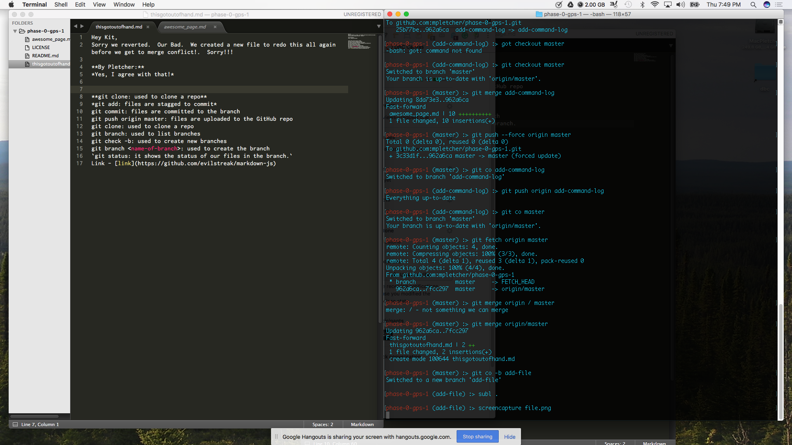

Hey Kit,
Sorry we reverted.  Our Bad.  We created a new file to redo this all again before we get to merge conflict!.  Sorry!!!

**By Pletcher:**
*Yes, I agree with that!*

**git clone: used to clone a repo**
*git add: files are stagged to commit*
git commit: files are committed to the branch
*git push origin master: files are uploaded to the GitHub repo*
*git clone: used to clone a repo*
**git branch: used to list branches**
git check -b: used to create new branches
git branch <name-of-branch>: used to create the branch
`git status: it shows the status of our files in the branch.`
Link - [link](https://github.com/evilstreak/markdown-js)

Inline-style:

Ah, i think i was suppose to do release 4 part - joseph